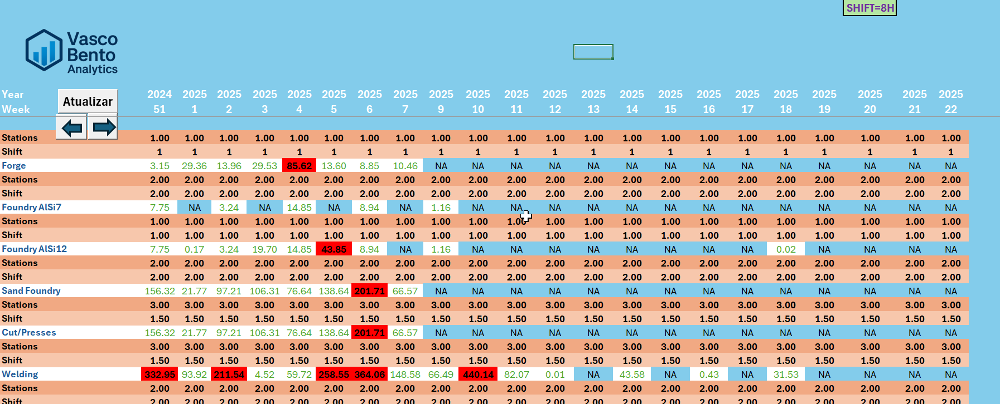

### Production Load Analysis Dashboard

📷 **Screenshot**  

---

**Description**  
An Excel-based dashboard designed to monitor weekly production loads per station, shift, and manufacturing process. It enables operational visibility of workload distribution across the shop floor, incorporating capacity indicators, time navigation, and structured scheduling logic.

---

**Key Features**
- Weekly production load visualization (by process, station and shift)
- Shift configuration and station capacity per week
- Color-coded thresholds for overloads, underloads, and “NA” periods
- Navigation arrows to scroll through weeks dynamically
- Organized by manufacturing steps: Forge, Foundry AlSi7, Foundry AlSi12, Welding, etc.
- Supports 8H shift constraints and load balancing assumptions

---

**Tech Stack**
- Microsoft Excel  
  - Conditional Formatting (color logic)  
  - Form Controls (arrows, update button)  
  - Structured tables and formulas

---

### Data Disclaimer

> *All values are masked to protect confidentiality.*  
> *Real data has been transformed using consistent proportional logic.*  
> *The visual and logical structure remains representative of real-world business scenarios.*

---

👤 **Author**  
[Vasco Bento](https://www.linkedin.com/in/vasco--bento)
